# VLLM Architecture Overview

## Project Description

VLLM is a high-throughput and memory-efficient inference engine for Large Language Models (LLMs). It provides easy, fast, and cheap LLM serving for everyone with state-of-the-art features like PagedAttention, continuous batching, and distributed execution.

## High-Level Architecture

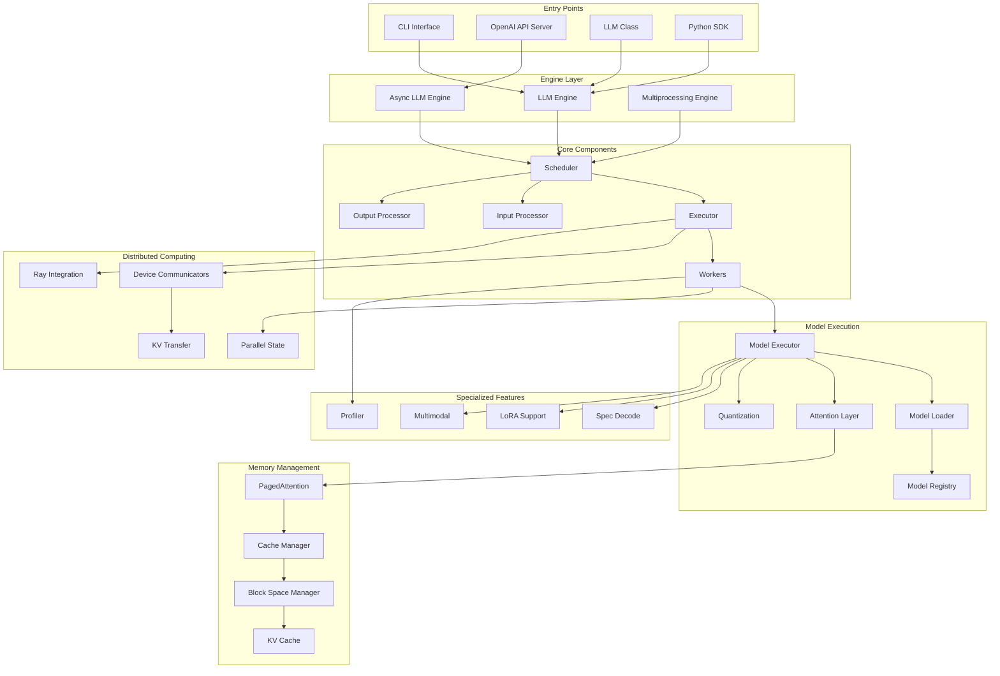

## Component Details

### 1. Entry Points (`vllm/entrypoints/`)

The entry points provide different interfaces for accessing VLLM functionality:

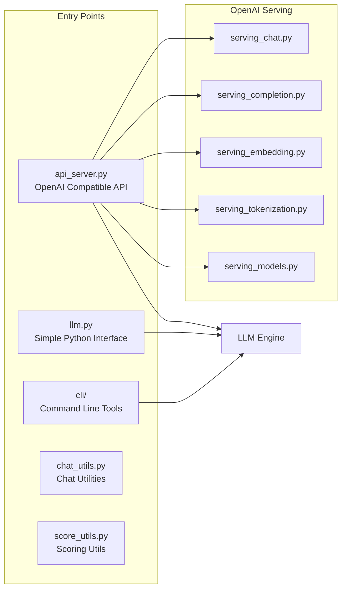

**Key Functions:**
- **api_server.py**: FastAPI-based OpenAI-compatible API server
- **llm.py**: Simple Python class interface for direct model usage
- **cli/**: Command-line interfaces for serving and inference
- **OpenAI serving modules**: Handle different OpenAI API endpoints (chat, completion, embedding, etc.)

### 2. Engine Layer (`vllm/engine/`)

The engine layer manages the overall execution flow and request handling:

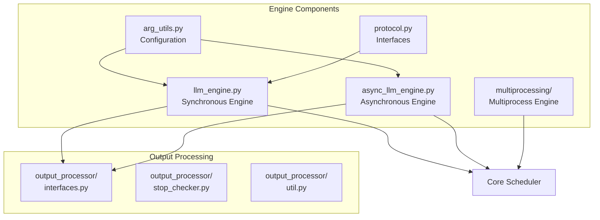

**Key Functions:**
- **LLMEngine**: Core synchronous engine handling request processing
- **AsyncLLMEngine**: Asynchronous wrapper for concurrent request handling
- **Multiprocessing Engine**: Enables multi-process execution for better scalability
- **Output Processors**: Handle response formatting, stopping criteria, and result aggregation

### 3. Core Scheduler (`vllm/core/`)

The scheduler manages request batching, memory allocation, and execution ordering:

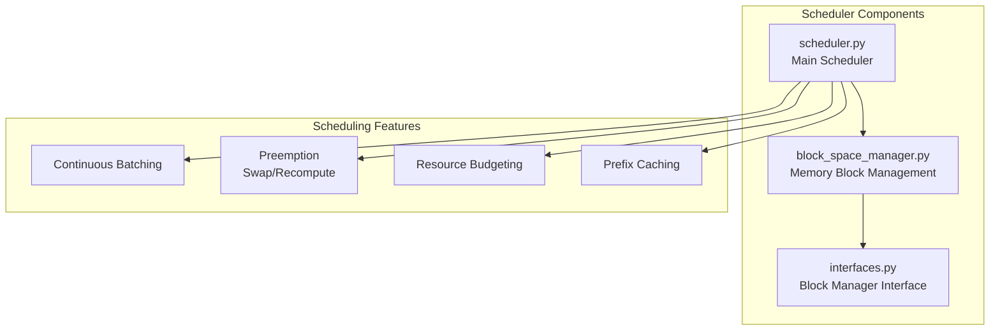

**Key Functions:**
- **Request Scheduling**: Intelligent batching of requests for optimal throughput
- **Memory Management**: Efficient allocation and deallocation of GPU memory blocks
- **Preemption**: Swapping or recomputing sequences when memory is needed
- **Prefix Caching**: Caching common prefixes to avoid recomputation

### 4. Execution Layer (`vllm/executor/` & `vllm/worker/`)

Manages distributed execution across multiple devices:

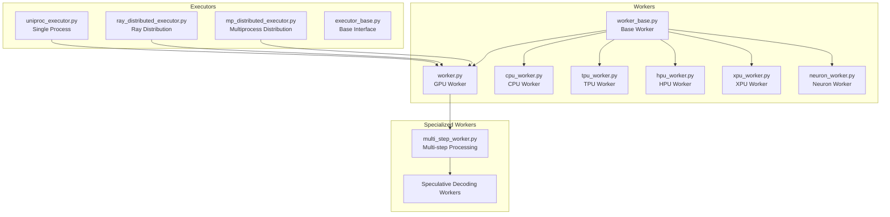

**Key Functions:**
- **Distributed Execution**: Support for tensor parallelism and pipeline parallelism
- **Multi-Device Support**: GPU, CPU, TPU, HPU, XPU, and Neuron backends
- **Ray Integration**: Scalable distributed computing with Ray
- **Specialized Workers**: Multi-step processing and speculative decoding

### 5. Model Executor (`vllm/model_executor/`)

Handles model loading, execution, and optimization:

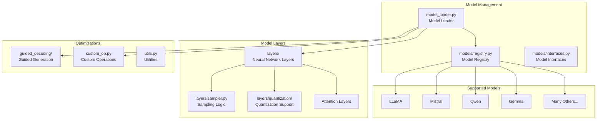

**Key Functions:**
- **Model Registry**: Central registry of supported model architectures
- **Dynamic Loading**: Runtime model loading with configuration validation
- **Quantization**: Support for GPTQ, AWQ, AutoRound, INT4/INT8/FP8
- **Custom Kernels**: Optimized CUDA kernels for better performance

### 6. Attention & Memory Management (`vllm/attention/`)

Core memory-efficient attention implementation:

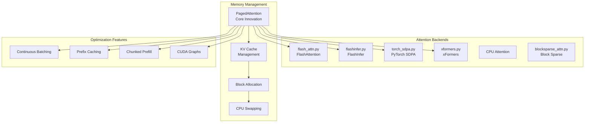

**Key Functions:**
- **PagedAttention**: Revolutionary memory management for attention computation
- **Multiple Backends**: Support for various attention implementations
- **Continuous Batching**: Dynamic request batching for optimal throughput
- **Memory Optimization**: Efficient KV cache management with swapping

### 7. Distributed Computing (`vllm/distributed/`)

Handles communication between distributed workers:

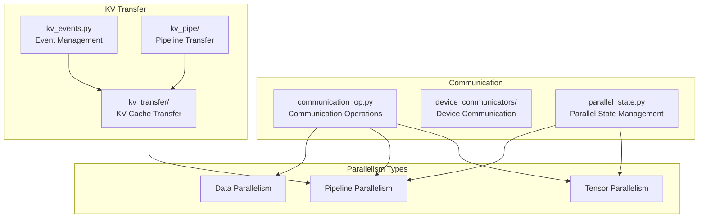

**Key Functions:**
- **Tensor Parallelism**: Distribute model weights across multiple GPUs
- **Pipeline Parallelism**: Distribute model layers across multiple GPUs
- **KV Cache Transfer**: Efficient transfer of attention caches between stages
- **Communication Optimization**: Minimize inter-GPU communication overhead

### 8. Specialized Features

#### Speculative Decoding (`vllm/spec_decode/`)

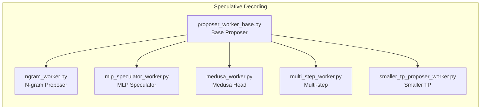

#### LoRA Support (`vllm/lora/`)

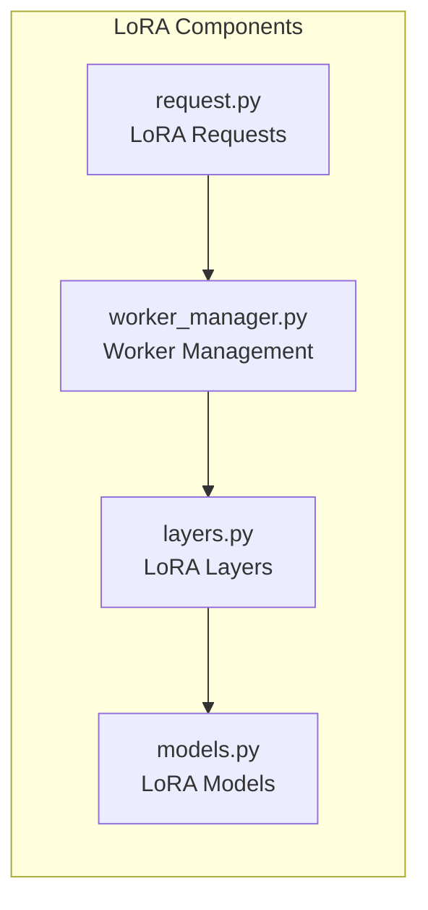

#### Multimodal Support (`vllm/multimodal/`)

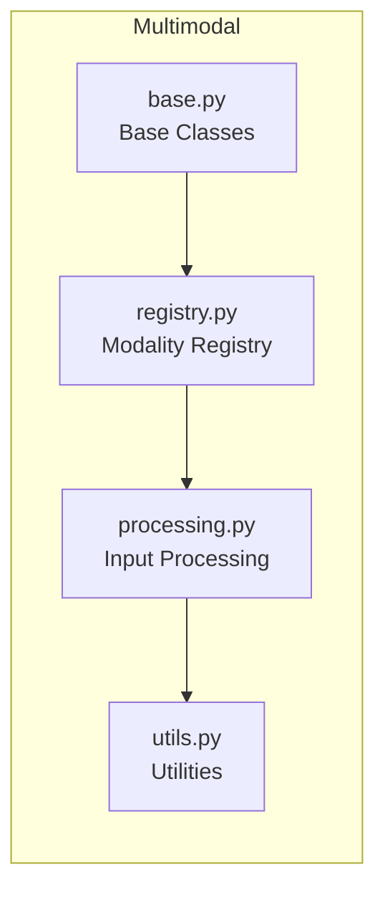

## Data Flow

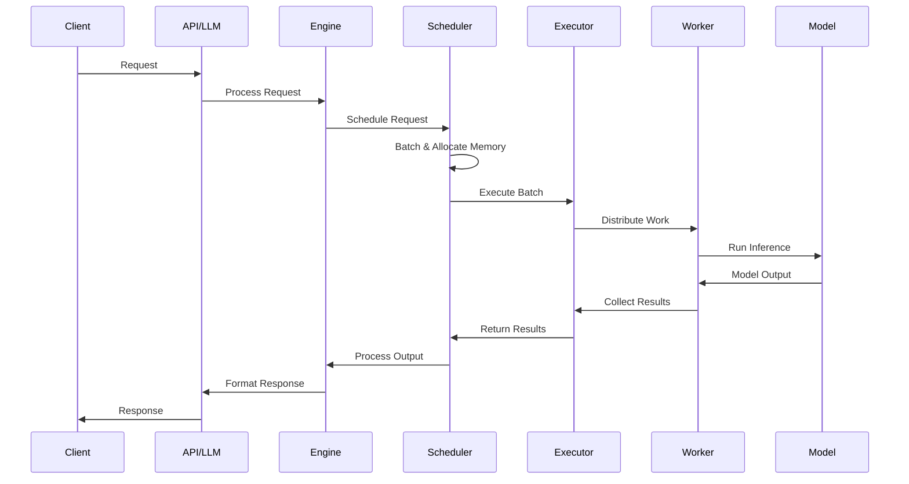

## Key Innovations

1. **PagedAttention**: Virtual memory-style management for attention computation
2. **Continuous Batching**: Dynamic request batching for optimal throughput
3. **Prefix Caching**: Intelligent caching of common prefixes
4. **Multi-backend Support**: Flexible attention backend selection
5. **Distributed Execution**: Efficient tensor and pipeline parallelism
6. **Speculative Decoding**: Accelerated generation with speculation
7. **Multi-modal Support**: Unified interface for text, image, and other modalities

## Performance Features

- **High Throughput**: State-of-the-art serving performance
- **Memory Efficiency**: Optimal GPU memory utilization
- **Low Latency**: Fast model execution with CUDA graphs
- **Scalability**: Support for large-scale distributed deployment
- **Flexibility**: Multiple deployment options and serving interfaces

This architecture enables VLLM to achieve superior performance while maintaining ease of use and flexibility for various deployment scenarios.